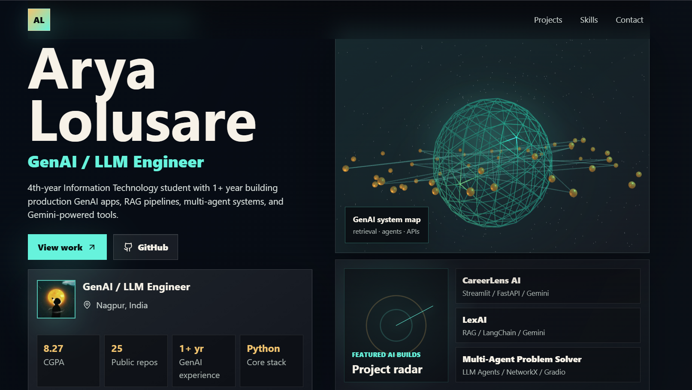

# Arya Lolusare Portfolio Website

A modern full-stack portfolio website showcasing my projects, skills, achievements, and experience as a GenAI / LLM Engineer and Full-Stack Developer.

<p align="center">
  
</p>

---

## About Me

I'm a 4th-year Information Technology student passionate about:

- Generative AI
- Large Language Models (LLMs)
- RAG Systems
- Multi-Agent AI
- Full-Stack Development
- FastAPI & Python
- AI Product Development

I enjoy building intelligent applications that solve real-world problems using modern AI technologies.

---

## Features

### Modern Portfolio Design

- Futuristic AI-inspired UI
- Fully responsive layout
- Mobile-friendly design
- Smooth user experience

### Project Showcase

- Featured AI projects
- Tech stack display
- Project descriptions
- GitHub repository links

### Dynamic Architecture

- React frontend
- FastAPI backend
- API-driven profile data
- Scalable structure

### Professional Profile

- Skills section
- Education details
- Achievements
- Experience highlights

---

## Tech Stack

### Frontend

- React.js
- Vite
- JavaScript
- HTML5
- CSS3

### Backend

- FastAPI
- Python

### Tools & Technologies

- Git
- GitHub
- npm
- Uvicorn
- VS Code

---

## Project Structure

```text
portfolio/
│
├── frontend/               # React + Vite Frontend
├── backend/                # FastAPI Backend
├── package.json
├── .gitignore
└── README.md
```

---

## Installation

### Clone Repository

```bash
git clone https://github.com/AryaLolusare2712/ALconnect.git

cd ALconect
```

### Install Frontend Dependencies

```bash
cd frontend

npm install
```

### Create Python Virtual Environment

```bash
cd ../backend

python -m venv .venv
```

Windows:

```bash
.venv\Scripts\activate
```

Linux / Mac:

```bash
source .venv/bin/activate
```

### Install Backend Dependencies

```bash
pip install -r requirements.txt
```

---

## Running the Application

### Start Backend

```bash
uvicorn app.main:app --reload --host 127.0.0.1 --port 8000
```

Backend URL:

```text
http://127.0.0.1:8000
```

### Start Frontend

```bash
cd frontend

npm run dev
```

Frontend URL:

```text
http://127.0.0.1:5173
```

---

## Featured Projects

### CareerLens AI

AI-powered career guidance platform that analyzes user profiles and recommends personalized career opportunities.

**Tech Stack**

- Gemini
- FastAPI
- Streamlit
- Python

### Legal Document Analyzer

An intelligent contract analysis tool that extracts clauses, identifies risks, and summarizes legal documents.

**Tech Stack**

- Gemini
- LangChain
- FastAPI
- Python

### Personalized Interview Preparation Coach

An AI-powered interview preparation platform featuring:

- Resume-based Q&A
- Coding interview simulations
- HR interview simulations
- AI feedback and scoring

**Tech Stack**

- LLMs
- Python
- Gradio
- FastAPI

### AI Investment Estimator

A financial intelligence platform that predicts investment outcomes and assists users with financial decision-making.

**Tech Stack**

- Python
- AI Models
- Financial Analytics

### Equity News Research & Q&A Tool

An AI assistant that analyzes financial news and answers investment-related questions using LLMs.

**Tech Stack**

- Gemini 1.5 Flash
- Gradio
- Python

### Multi-Agent Problem Solver

A collaborative AI system where multiple agents work together to solve complex tasks.

**Tech Stack**

- NetworkX
- Gradio
- LLM Agents
- Python

---

## Achievements

- Built multiple AI-powered applications
- Experience with RAG systems and AI agents
- Developed full-stack AI products
- Strong foundation in Data Structures and Algorithms
- Passionate about solving real-world problems using AI

---

## Currently Learning

- Advanced System Design
- Agentic AI Workflows
- LangGraph
- Vector Databases
- Cloud Deployment
- Full-Stack Engineering

---

## Future Improvements

- Dark/Light Theme Toggle
- Blog Section
- AI Chat Assistant
- Project Analytics Dashboard
- Admin Panel
- Resume Download Feature
- Contact Form Integration
- Cloud Deployment

---

## Contributing

Contributions, issues, and feature requests are welcome.

Feel free to fork the repository and submit a pull request.

---

## Connect With Me

GitHub: https://github.com/AryaLolusare2712

LinkedIn: www.linkedin.com/in/arya-lolusare-6530662b4

Email: ayalolusare0909@gmail.com

---

<p align="center">
Built and designed by Arya Lolusare
</p>
